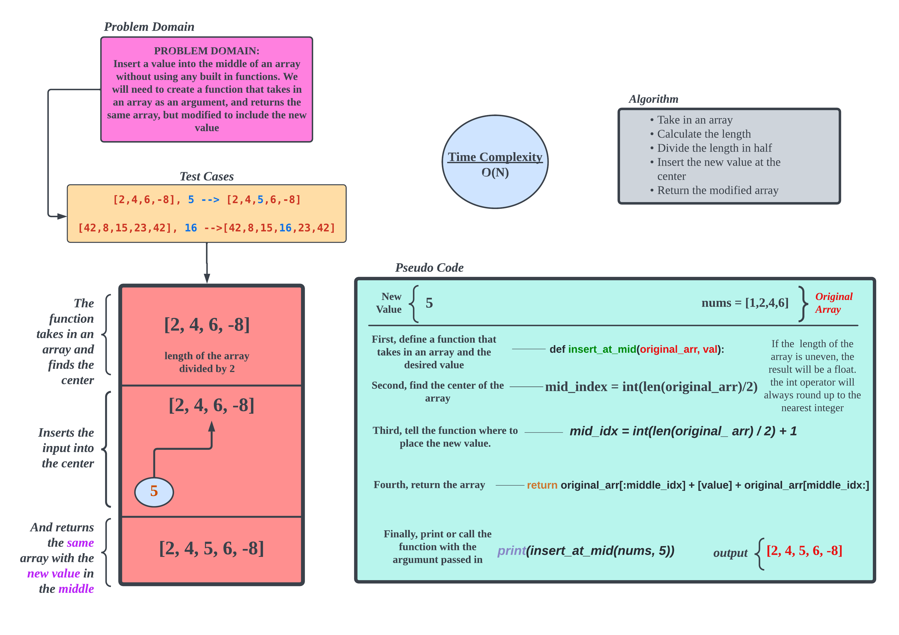
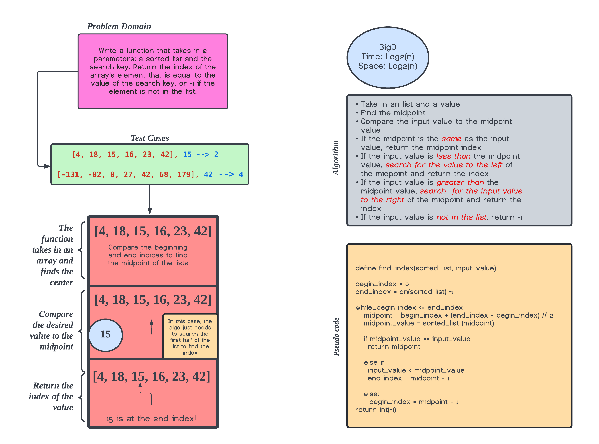

# Data Structures and Algorithms

## Language: `Python`

## Reverse an Array

The challenge here is to reverse the contents of an array(or list in Python) without using any built in methods. The process needs to be explained to someone new to code.

## Approach & Efficiency

The slicing approach is taken because it provides the simplest way to reverse the values of a given array, being that we cannot use methods like array.reverse.

## Array-Insert-Shift

The challenge here is to add a value to the middle of an array(or list in Python) without using any built in methods. The process needs to be explained to someone new to code.

### Approach & Efficiency

The concatenation approach is taken because it provides the simplest way to append the new value to the given array, being that we cannot use methods like array.insert.

### Time Complexity
The Time Complexity for this algorithm grows along with the amount of data elements making it: O(N)

### Array-Binary-Search

The challenge here is to add a find the index of a value an array(or list in Python) without using any built in methods. The process needs to be explained to someone new to code.

## Approach & Efficiency

The approach taken here is to find the center of the array, then compare the input value to the midpoint value. Then we can shorten the number of values we need to search to find our desired index.

### Time Complexity
The Time Complexity for this algorithm  only grows one step when the amount of data elements doubles, making it: O(Log N)

### Linked List Insertion

The challenge here is create three methods that modify a linked list. One to append the list, one to insert a node before one containing a specified value, and one to insert after a specified node.

## Approach & Efficiency

The approach taken here is to find node with the value we want, swap places between the next node and the specified node. The approach for the append method is to the end of the list, then append a new node to the end.

### Time Complexity
The Time Complexity for this algorithm grows along with the amount of data elements making it: O(N)
