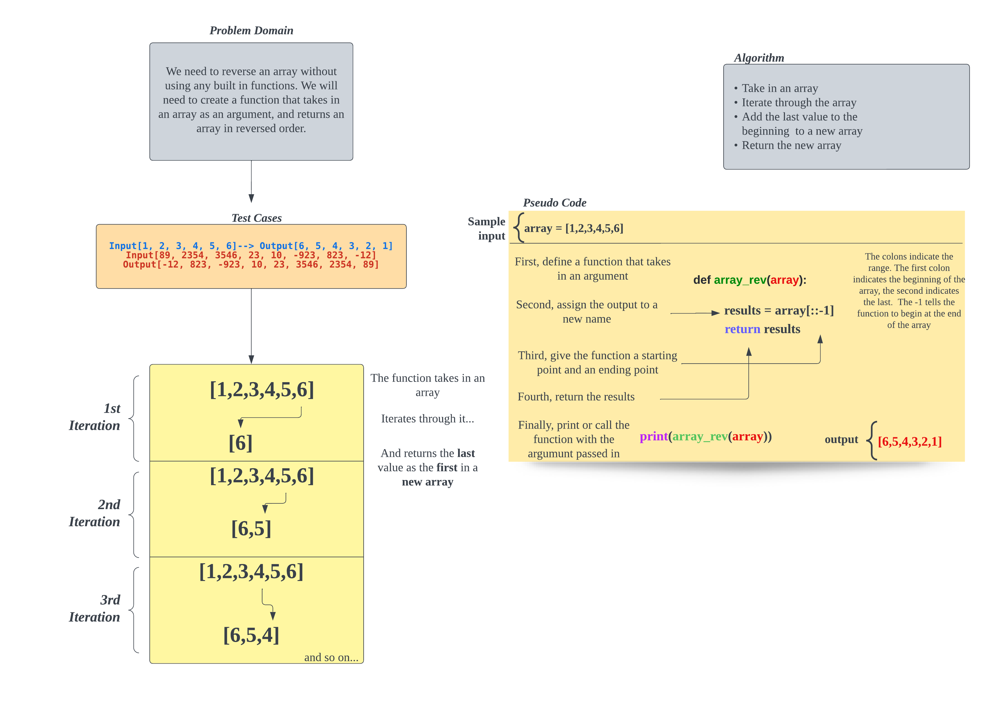
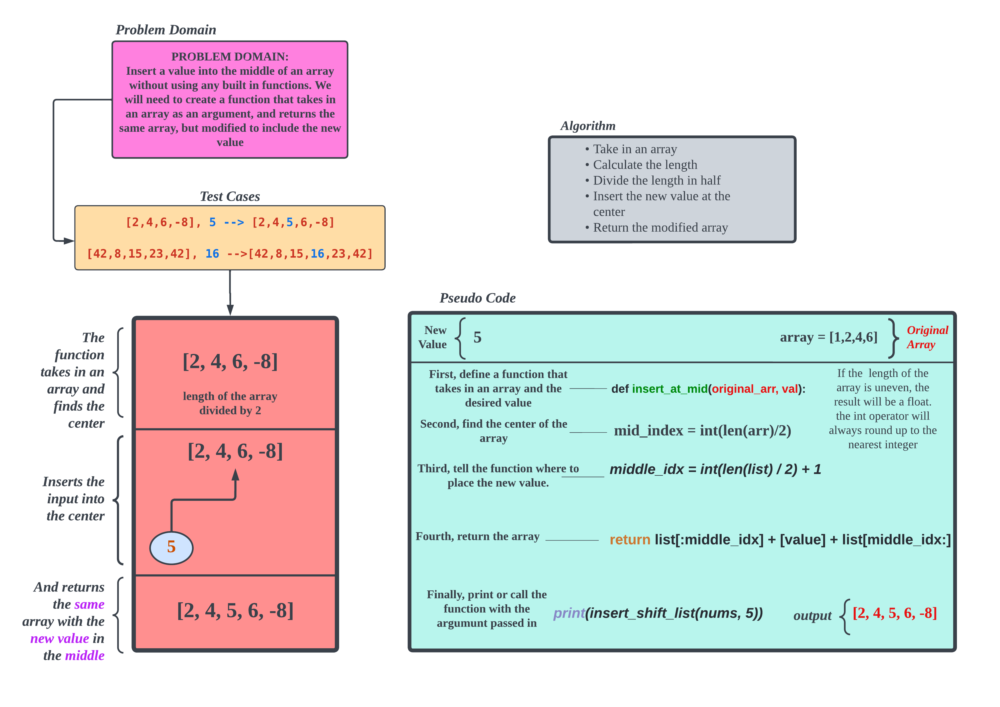

# Data Structures and Algorithms

## Language: `Python`

## Reverse an Array

The challenge here is to reverse the contents of an array(or list in Python) without using any built in methods. The process needs to be explained to someone new to code.

## Approach & Efficiency

The slicing approach is taken because it provides the simplest way to reverse the values of a given array, being that we cannot use methods like array.reverse.

## Array-Insert-Shift

The challenge here is to add a value to the middle of an array(or list in Python) without using any built in methods. The process needs to be explained to someone new to code.

## Approach & Efficiency

The concatenation approach is taken because it provides the simplest way to append the new value to the given array, being that we cannot use methods like array.insert.
