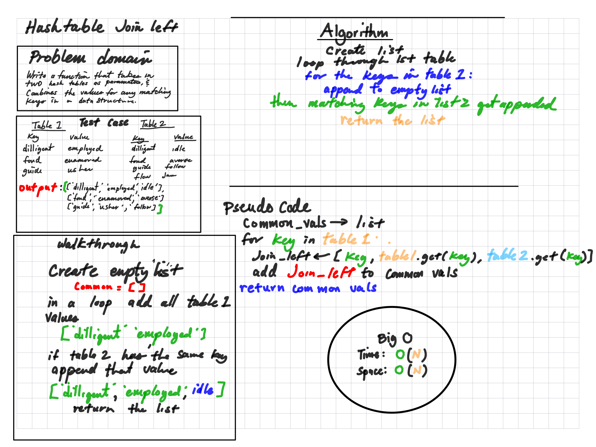

# Hashtable Left Join

Here we will write a function that takes two hashtables in a parameters and adds the values for matching keys into a single a single data structure

## Challenge

The challenge is to check the keys in the first table in a for loop, and append the values for the key in both tables to an empty list.

## Whiteboard

## Approach & Efficiency

Big O time complexity for these operations O(N).

Big O space complexity for the set function is also O(N)

[Code](../../code_challenges/hashtable_left_join.py)

[Tests](../../tests/code_challenges/test_hashtable_left_join.py)
