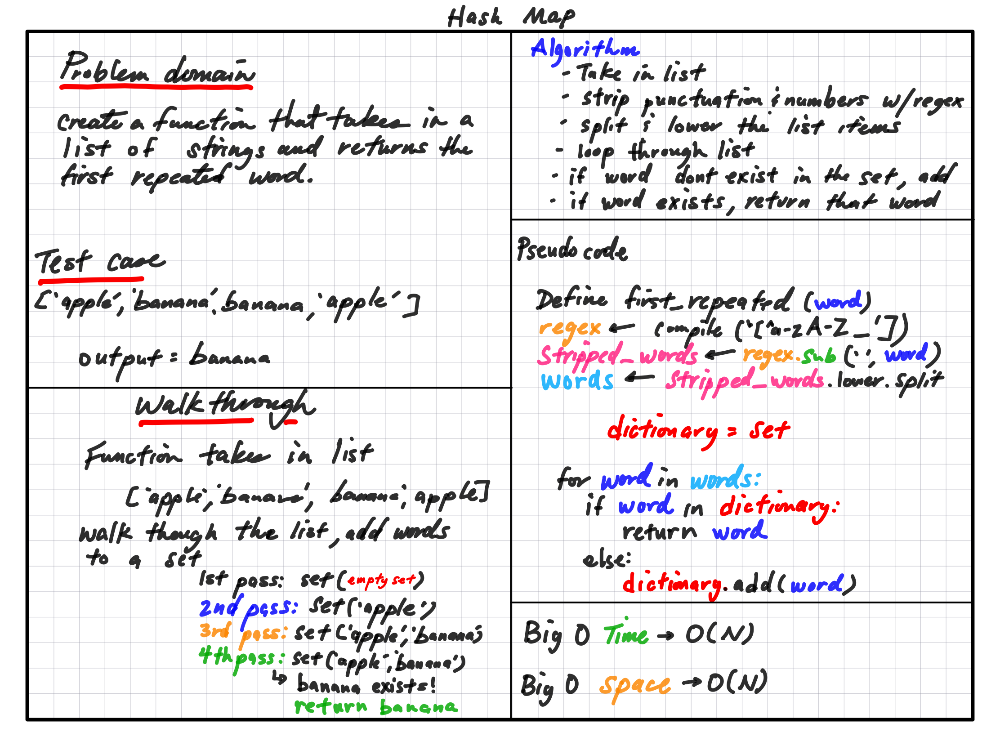

# Challenge Summary

Write a function called repeated word that finds the first word to occur more than once in a list of strings.

## Whiteboard Process

## Approach & Efficiency

The approach here is to strip out all non alphabetic characters, and loop throughth string, adding one word at a time into a set. Since sets dont allow duplicates, we return the word if it exists in the set.

The Big O time complexity for this approach is O(n) where n is the number of words passed into the function. The space complexity is also O(n) becasue the size of the data doesn't grow.

## Solution

To run the algorithm clone the repository and run pytest.
