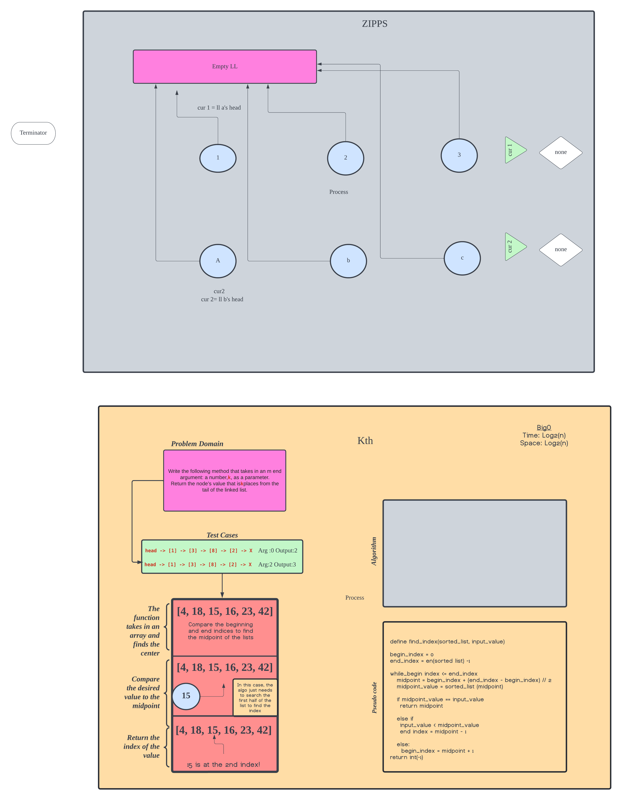

# Array-Insert-Shift

The challenge here is to combine two linked lists together in a zipped fashion. The process needs to be explained to someone new to code.

## Approach & Efficiency

The approach was to create a dummy linked list, then populate it with the values from the two given linked lists in an alternating fashion

## Time Complexity

The Time Complexity for this algorithm grows along with the amount of data elements making it: O(N)

