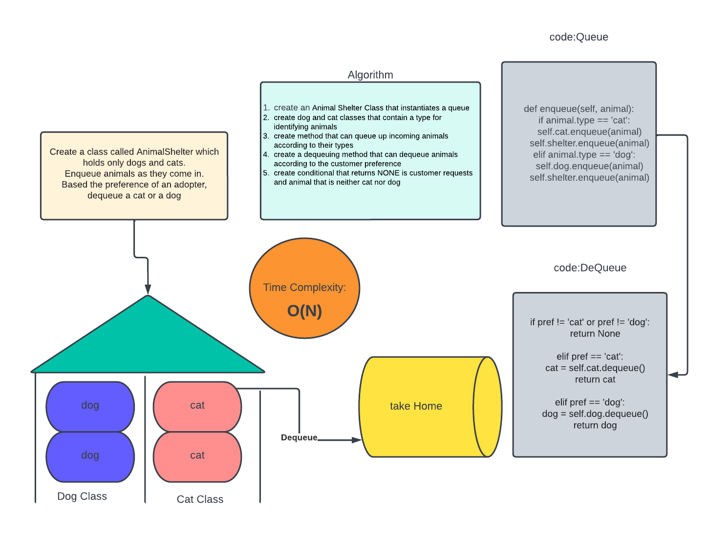

# Animal Shelter

The Challenge is to create an Animal Shelter Class that takes in cats and Dogs. Then dequeue the animals according to customer preference.

## Approach & Efficiency

The approach here was first create a queue for each type of animal. Then to enqueue the animal objects with types into their own queues. Finally, dequeue the animals as requested.

## Time Complexity

The time complexity for these methods was O(N).

