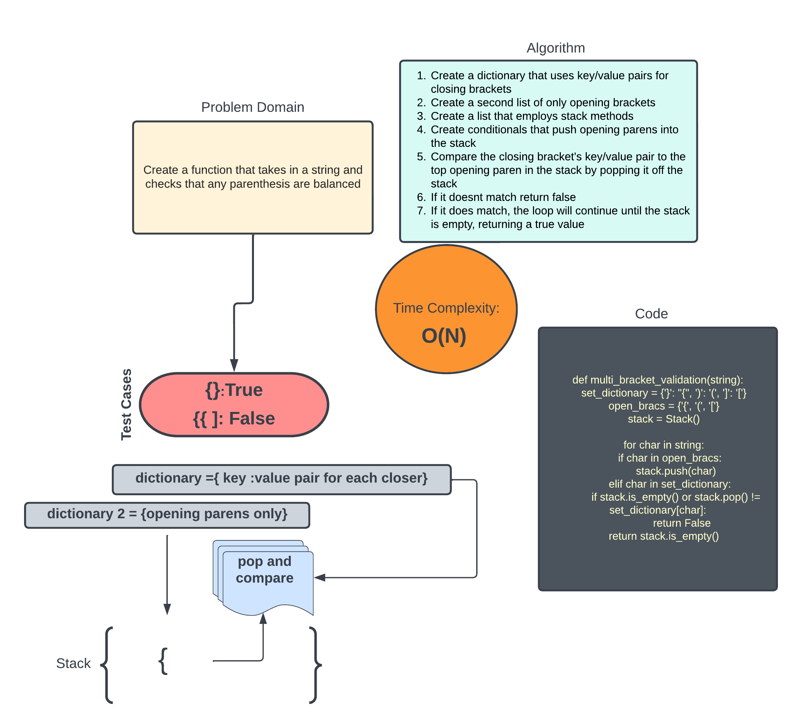

# Bracket Validation

The Challenge is to create a function that takes in a string and makes sure the parentheses all are complete sets. Returns True or False

## Approach & Efficiency

The approach here was first create a dictionary that matches a closing parenthesis with its correspondeing opener. Next create a dictionary of only opening parens.

Take in the string and compare each parenthesis to either list.
Opening parentheses go into a stack and are popped from the stack when a closing parenthesis is encountered. It is then compared to the value for the key closing parenthesis.

## Time Complexity

The time complexity for these methods was O(N).

