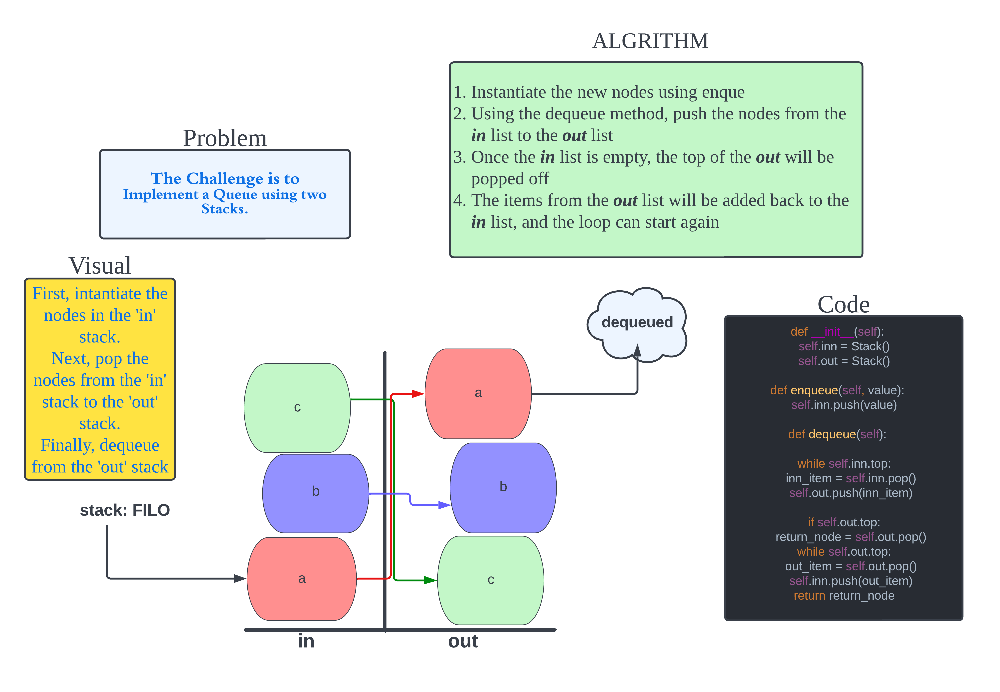

# Stack Queue Pseudo

Implement a Queue using two Stacks.

## Approach & Efficiency

The Approach is to use two stacks to simulate a queue by moving the nodes between the list, then popping a desired value when a specific condition is met

## Big O

 The Time Performance should be O(N)

[Stacks Pseudo Queues](code_challenges/stack_queue_pseudo.py)

