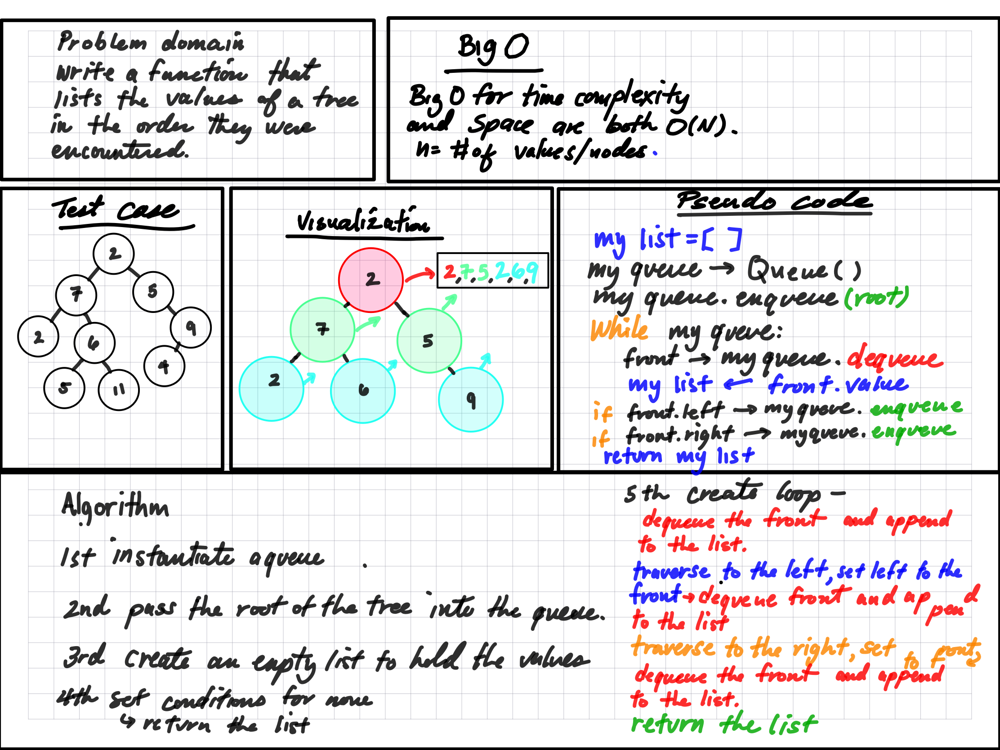

# Tree Breadth First

A binary tree is a data structure that contains a root node and nodes that are offshoots to the left and right. The node down the tree is called a leaf, and leaves have no offshoots.

## Challenge

This challenge is to write a function that can return a list comprised of the values of a node in the order that they are encountered

## Approach & Efficiency

The approach here is to create a queue that will be populated by the tree's values, then append those values into an empty list.

The Big O time complexity for searching for a specific node value in a binary is O(n) where n is the number of nodes in the tree. Space is the same, except that n is the widest point of the tree

