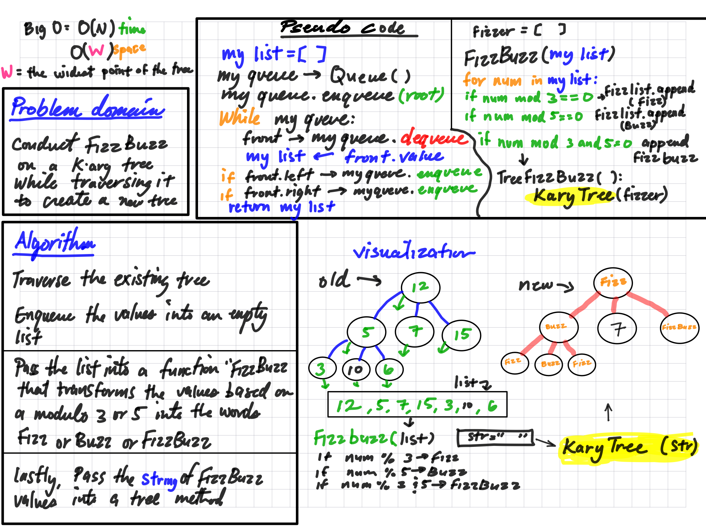

# Tree Fizz Buzz

A binary tree is a data structure that contains a root node and nodes that are offshoots to the left and right. The node down the tree is called a leaf, and leaves have no offshoots.

## Challenge

This challenge is to write a function that can take in a k-ary tree and return a new tree with the values of the Fizzbuzz challenge.

## Approach & Efficiency

The approach here is to use an existing create a queue that will be populated by the tree's values, then append those values into an empty list. Pass that list into a helper method that tranforms the values into 'fizz', 'buzz', or 'fizzbuzz' based on on mod 3 or 5 or both. This function returns a string that will then be passed into a string method to create the nodes of a new binary tree.

## Big O

The Big O time complexity for searching for a specific node value in a binary is O(n) where n is the number of nodes in the tree. Space is O(w), where 'w' is the widest point of the tree.

