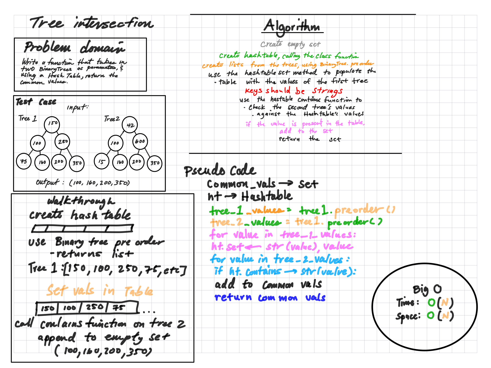

# Hashtables

Here we will write a function that takes in two binary trees and returns the common values.

## Challenge

The challenge is to walk through the two trees, and append the common values to a list. A hastable should be used to compare the values in the two trees.

## Approach & Efficiency

The approach here is to create a list for each tree, usinag a binary search function. Then check the second list and append the common values to a common list if it exists in the hash table.

Big O time complexity for this operation is O(N). The worst case scenario being that the two trees are identical. WIth 3 separate lists, the Big O is O(3N), but we drop the ordinal number.

Big O space complexity for the this operation is still O(N). Again, the worst case scenario is that the two trees are identical, and all the values are appended to the common list.

[Code](../../code_challenges/tree_intersection.py)

[Tests](../../tests/code_challenges/test_tree_intersection.py)
