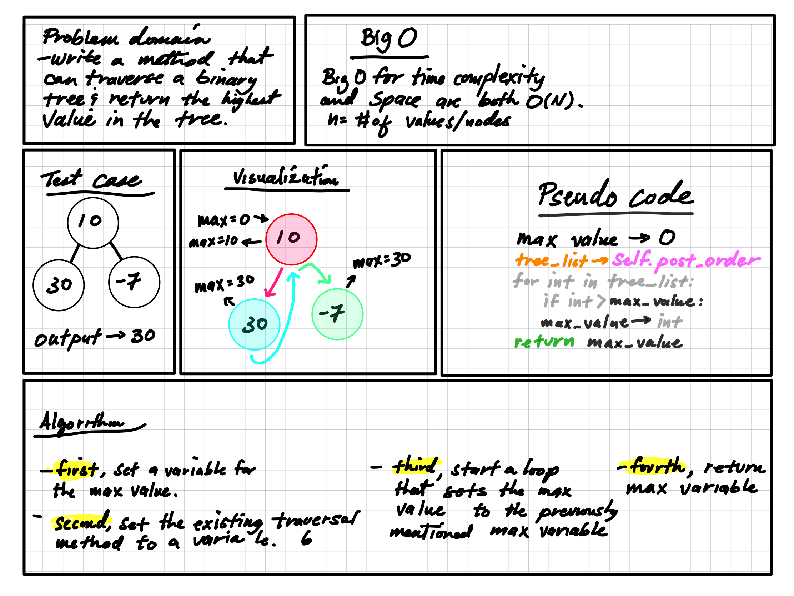

# Tree Max

A binary tree is a data structure that contains a root node and nodes that are offshoots to the left and right. The node down the tree is called a leaf, and leaves have no offshoots.

## Challenge

This challenge is to create a method that can find the largest value in a binarey tree without using Python's built in methods.

## Approach & Efficiency

To solve this problem we could set the max as a temporary value that is replaces the max each time the search finds a higher value node. But, since we have previously created 3 seperate methods for searching a binary tree, we can use one of them to keep the code clear and concise. The max value will be returned at the end of the search.

The Big O time complexity for searching for a specific node value in a binary is O(n) where n is the number of nodes in the tree.

