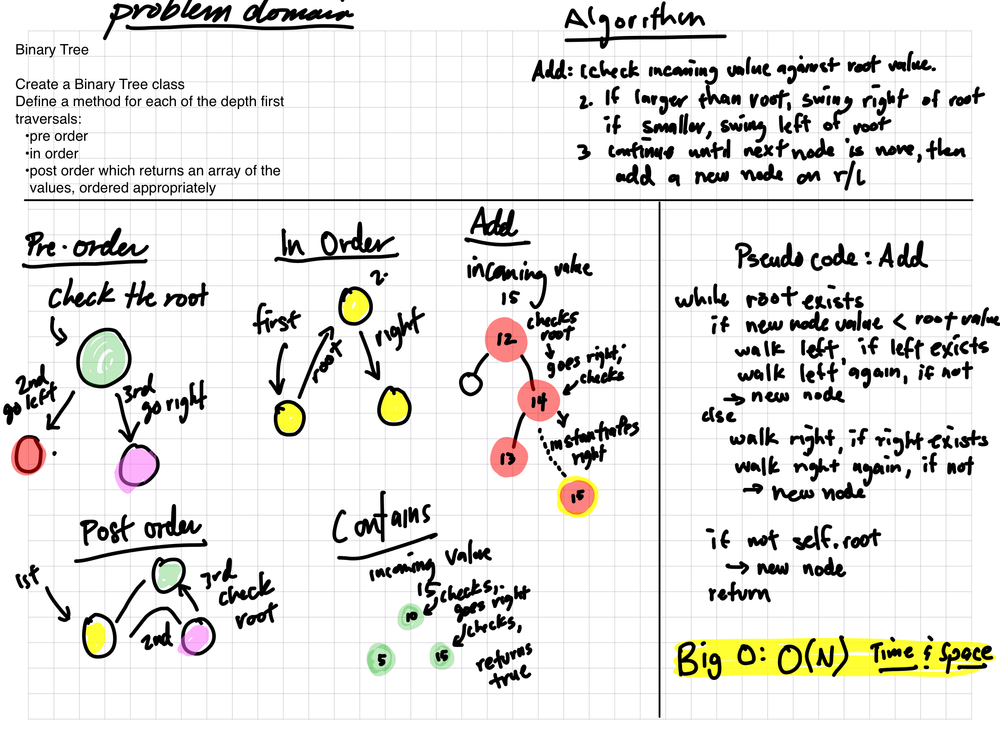

# Trees

A binary tree is a data structure that contains a root node and nodes that are offshoots to the left and right. The node down the tree is called a leaf, and leaves have no offshoots.

## Challenge

This challenge is  to create a Node class that has properties for the value stored in the node, the left child node, and the right child node.

And secondly, create methods to instantiate binary trees and then search the tree for values.

## Approach & Efficiency

The Big O time complexity for inserting a new node is O(n). Searching for a specific node will also be O(n)

The Big O time complexity of a Binary Search Tree’s insertion and search operations is O(N) where N is the maximum height of the tree.

## API

1. Pre-order: This method starts by looking at the root, then heads to the left node, then the right node. If you want to see the root value, this method can be used.
2. In-order: This method begins by going the left, then checking the root, and finally going to the right leaf node
3. Post-order: This method starts with the left node, checks the right node, then finally hits the root node.
4. Add: Takes in a value to add to the tree. Checks to see if the root is none. If the root exists, the value is checked against the root.
If the incoming value is smaller, and new node is instatiated on the left of the root.
If the incoming value is larger, the new node goes on the right of the root node.
5. Contains: Checks to see if a value is contained in the tree. Returns True or False.
If the value is at the root: Returns True.
If the value is smaller than the root, only the left side of the root is checked. The the loop begins again.

If the value is larger than the root, only the right side of the root is checked. The the loop begins again.

If the root is NONE, or the left/right nodes are None: Returns False

