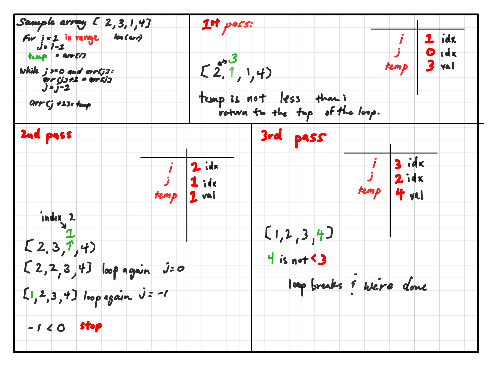

# Insertion-Sort

In this challenge, we write a function that can sort a list in ascending order

## Whiteboard Process

## Approach & Efficiency

The time complexity for Insertion-Sort is O(n^2) because the algorithm has to iterate through the array and do the same number of steps for each index.

The space is O(1) since the size of the data does not change throughout the process.

## Solution

To run the code, clone the repo and run tests using pytest.

The code is located in *python/code_challenges/insertion_sort.py*

The tests are located at *python/tests/code_challenges/test_insertion_sort.py*

To run the test enter the 'pytest' command at the root of the repository, or use *pytest -k python/tests/code_challenges/test_insertion_sort.py*

[Code](python/code_challenges/insertion_sort.py)
[Tests](python/code_challenges/insertion_sort.py)
